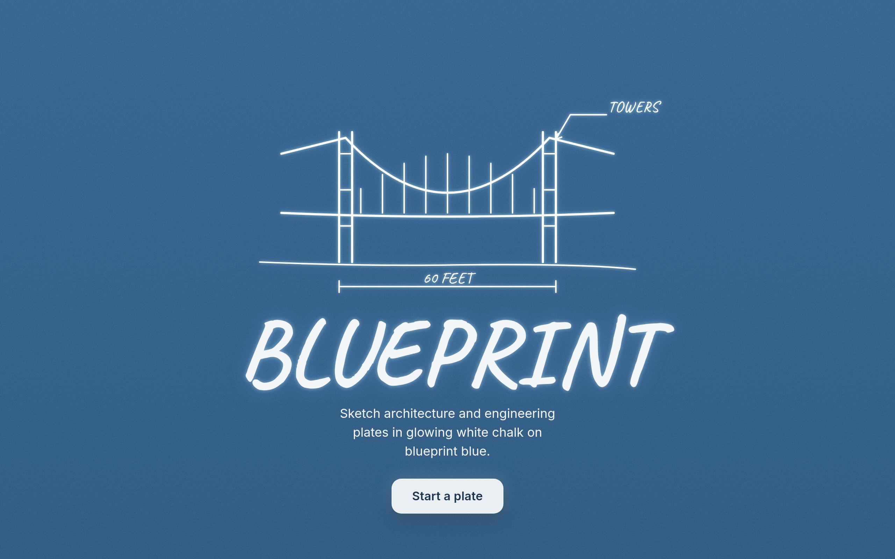

# BLUEPRINT

Sketch architecture and engineering plates in glowing white chalk on blueprint
blue. A small, opinionated drafting surface in the style of the original M5
Industries / MythBusters plates, with a soft mid‑2000s broadcast bloom.

Built on the [tldraw](https://tldraw.dev) SDK with its default UI fully replaced
by a branded dock and top bar.



## What it does

- **White‑chalk drawing** on a grained blueprint‑blue field — pressure‑aware
  freehand, no grid, no color picker (white only).
- **Diagram primitives** that keep the hand‑drawn look but behave like real
  vector shapes: a **dimension line** (end ticks + editable measurement), a
  **leader callout** (label + arrow to a draggable target), and a **numbered
  part list** (titled block with inline add/remove rows). Typed labels render in
  the handwritten Caveat face.
- **Bloom** — a live CSS‑filter glow (the only glow source), toggleable, and
  baked into PNG export.
- **Plate frame** — an optional thin white border with corner registration
  targets, for the full M5 plate look.
- **Export** — client‑side PNG (`blueprint.png`) with the blue field, ink, and
  bloom composited in.
- **Auto‑save** to the browser via tldraw's local persistence; reload‑safe.

## Tech

React + TypeScript + Vite, tldraw v5, `HashRouter`. Fonts (Caveat, Inter) and
all tldraw assets are self‑hosted — the site has no runtime CDN dependency.

```
src/
  pages/        Hero (landing) and Editor (lazy-loaded canvas route)
  canvas/       background, white-ink override, components map, self-hosted assets
  shapes/       custom ShapeUtils: dimension line, leader callout, part list
  ui/           floating dock, top bar, icons
  bloom/        CSS-filter bloom
  export/       PNG export with bloom + field baked in
```

## Develop

```bash
npm install
npm run dev        # http://localhost:5173/tldraw-blueprints/
npm run build      # type-check + production build to dist/
npm run preview    # serve the production build
```

## Deploy (GitHub Pages)

The repo ships a workflow at `.github/workflows/deploy.yml` that builds and
publishes `dist/` to Pages. To enable it:

1. In the repo, go to **Settings → Pages**.
2. Set **Source** to **GitHub Actions**.
3. Push to `main` (or run the workflow manually). The site publishes at
   `https://<owner>.github.io/tldraw-blueprints/`.

The Vite `base` is `/tldraw-blueprints/` to match the project‑pages path. For a
custom domain or a different path, set `BASE_PATH` when building, e.g.
`BASE_PATH=/ npm run build`.

## Notes

- The small "Get a license for production" badge in the editor is tldraw's
  watermark for unlicensed use. Add a [tldraw license
  key](https://tldraw.dev/installation#License-key) via the `licenseKey` prop on
  `<Tldraw>` in `src/pages/Editor.tsx` to remove it.
